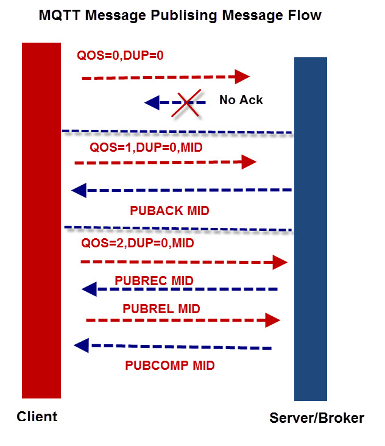

# MQTT CLient Study
학습 자료:   
http://www.steves-internet-guide.com/mqtt-python-beginners-course/   
https://www.eclipse.org/paho/index.php?page=clients/python/docs/index.php   
...   
## Introduction to the Paho Python MQTT Client
### 설치
~~~
$ pip install paho-mqtt
~~~
### Main Client Methods   
- connect() and disconnect()   
- subscribe() and unsubscribe()   
- publish()   
### Client 객체
Client 생성자는 다음과 같이 4개의 파라미터를 받는다. **client_id는 Unique해야하며 필수이다.**
~~~
Client(client_id=””, clean_session=True, userdata=None, protocol=MQTTv311, transport=”tcp”)
~~~
인스턴스를 생성하기 위해 다음과 같이 작성한다.   
~~~
client = mqtt.Client(client_name)
~~~
### Broker나 Server에 연결   
브로커에 연결하는 과정이 필요하다.   
이를 위해 connect method를 이용한다. broker name/IP address만 넘겨주어도 된다.   
~~~
connect(host, port=1883, keepalive=60, bind_address="")
~~~
다음과 같이 작성한다.   
~~~
client.connect(host_name)
~~~
클라이언트 연결 동작은 다음을 참고   
http://www.steves-internet-guide.com/client-connections-python-mqtt/   

### 메시지 발행(Publishing)   
연결했다면 이제 메시지를 발행할 수 있다. topic과 payload만 신경써서 전달해주면 된다.   
~~~
publish(topic, payload=None, qos=0, retain=False)
~~~
payload는 발행하고자 하는 메시지이다. 다음과 같이 작성한다.   
~~~
client.publish("house/light","ON")
~~~

### 예제 코드   
"OFF" 메시지를 "house/main-light" 토픽으로 발행하는 코드이다.   
~~~
import paho.mqtt.client as mqtt #import the client1
broker_address="192.168.1.184" 
#broker_address="iot.eclipse.org" #use external broker
client = mqtt.Client("P1") #create new instance
client.connect(broker_address) #connect to broker
client.publish("house/main-light","OFF")#publish
~~~

### 토픽 구독   
subscribe method를 이용한다.   
~~~
subscribe(topic, qos=0)
~~~
다음과 같이 작성한다.   
~~~
client.publish("house/bulbs/bulb1","OFF")
~~~

### 예제 코드
다음과 같은 순서로 동작한다.   
1. Create new client instance   
2. Connect to broker   
3. Subscribe to topic   
4. Publish message   
~~~
import paho.mqtt.client as mqtt #import the client1
broker_address="192.168.1.184" 
#broker_address="iot.eclipse.org"
print("creating new instance")
client = mqtt.Client("P1") #create new instance
print("connecting to broker")
client.connect(broker_address) #connect to broker
print("Subscribing to topic","house/bulbs/bulb1")
client.subscribe("house/bulbs/bulb1")
print("Publishing message to topic","house/bulbs/bulb1")
client.publish("house/bulbs/bulb1","OFF")
~~~

### Callback Function   
- Event Connection acknowledged Triggers the on_connect callback   
- Event Disconnection acknowledged Triggers the on_disconnect callback   
- Event Subscription acknowledged Triggers the  on_subscribe callback   
- Event Un-subscription acknowledged Triggers the  on_unsubscribe callback   
- Event Publish acknowledged Triggers the on_publish callback   
- Event Message Received Triggers the on_message callback   
- Event Log information available Triggers the on_log callback   

1. callback function을 생성.   
2. 함수를 callback에 할당.   

### Callback Function 예제   
- on_connect callback
~~~
def myfunction(client, userdata, flags, rc):
     logging.info("Connected flags"+str(flags)+"result code "\
     +str(rc)+"client1_id ")
     client.connected_flag=True
     
client.on_connect = myfunction
~~~
myfunction함수를 callback으로 할당하여 호출되도록 한다.   

### Callbacks and the Client Loop   
Callback들은 Client Loop에 의존한다.
~~~
import paho.mqtt.client as mqtt #import the client
import time

def on_connect(client, userdata, flags, rc):
     global loop_flag
     print("  In on_connect callback ")
     loop_flag=0

broker_address="192.168.1.184" 
print("creating new instance")
client = mqtt.Client("") #create new instance
client.on_connect=on_connect
client.connect(broker_address) #connect to broker
client.loop_start()

loop_flag=1
counter=0
while loop_flag==1:
     print("waiting for callback to occur ", counter)
     time.sleep(.01)
     counter+=1
client.disconnect()
client.loop_stop()
~~~
**실행결과**   
self.on_connect함수를 callback으로 할당해준 뒤, client loop를 시작하도록 한 코드이다.   
client loop를 시작하므로 연결될 시, self.on_connect callback함수를 통해 loop_flag를 0으로 바꾸어 waiting 작업을 하지 않도록 한다.   
   
위의 코드에서 다음과 같이 loop_start부분을 주석처리하고 다시 실행시켜보자.   
~~~
#client.loop_start()
~~~
무한루프인 것을 확인할 수 있다.   
   

- on_connect() callback   
4개의 인자를 처리한다. 브로커가 우리의 연결 요청에 응답하면 호출되는 callback이다.
~~~
on_connect(client, userdata, flags, rc)
~~~

### 비동기일까 아니면 동기일까?**   
loop_start() 또는 loop_forever 함수를 사용하는 경우, 루프는 별도의 스레드에서 실행되며, 이는 수신 및 송신 메시지를 처리하는 루프입니다.   
이 경우 스크립트에서 언제든지 콜백이 발생할 수 있으며 **비동기식**입니다.   
그러나 스크립트에서 loop() 함수를 **수동으로 호출**할 경우, loop() 함수를 호출할 때만 콜백이 발생할 수 있으므로 스크립트와 **동기화**됩니다.   

### Callback들에서 값 반환하기   
Callback에서는 일반적인 return방법으로 값을 반환할 수 없다.   
다음과 같은 선택지가 있다.   
- global statement를 이용해서 글로벌 변수를 선언하기.   
- main 함수에 선언된 list를 이용하기.   
- main 함수에 선언된 dictionary를 이용하기.   
- main 함수에 선언된 객체를 이용하기.   

**직접 적용해보기**   
예제 코드는 https://github.com/gjlee0802/Flask-MQTT-Study/blob/main/ex_code/mqtt/clientloop.py   

list와 queue 이용하기   
~~~
q=Queue()
messages=[]

def on_message(client1, userdata, message):
    #global messages
    m="message received  "  ,str(message.payload.decode("utf-8"))
    messages.append(m)#put messages in list
    q.put(m) #put messages on queue
    print("message received  ",m)
~~~
회수하는 방법   
~~~
while len(messages)>0:
    print(messages.pop(0))

while not q.empty():
    message = q.get()
    print("queue: ",message)
~~~

## Introduction to the Client Class   
### Client 클래스 소개   
Client 클래스는 모든 필수적인 함수들을 제공한다. (MQTT broker에 연결, 메시지 발행, 토픽 구독, 메시지 받기.)   
Client 클래스의 생성자는 다음과 같이 4가지 인자를 필요로 한다.   
~~~
Client(client_id=””, clean_session=True, userdata=None, protocol=MQTTv311, transport=”tcp”)
~~~
### The Client name (The Client ID)   
Client name은 선택사항이지만 clean sessions=True(기본값이 True)일 경우에만 선택사항이다.   
Client name을 주지 않으면 클라이언트 소프트웨어에 의해 랜덤하게 생성된다.   

### 중복된 Client id   
중복된 아이디로 클라이언트 연결을 시도하면 기존의 연결이 끊어지고 새로 연결된다.   
즉, 클라이언트는 동시에 같은 아이디를 사용할 수 없으며, **중복된 아이디는 피해야한다.**   

### Unique Client id 생성하기   

새로운 unique client id를 생성하기 위해 다음과 같은 스키마 선택지가 있다.   
- Client prefix + Serial number of device   
- Client prefix + Random Number   
- Client prefix + Time   
- Client prefix + time+random number   
   
**Example:** Prefix + random number – Myclient-902314   

### Clean Session Flag   
이 플래그는 브로커에게 다음 중 하나를 지시한다.   
- False: 클라이언트가 **오프라인** 상태여서 누락된 구독 및 메시지를 **저장**   
- True: 클라이언트가 **오프라인** 상태여서 누락된 구독 및 메시지를 **저장하지 않음** (defult값 = true)   

### 보조 함수나 설정들   
- max_inflight_messages_set() –메시지 처리량에 영향을 준다.   
- max_queued_messages_set() –메시지 처리량에 영향을 준다.   
- message_retry_set(retry) –A메시지 처리량에 영향을 준다.   
- tls_set() – SSL 보안을 위해 사용한다.   
- tls_insecure_set(value) –SSL 보안을 위해 사용한다.   
- username_pw_set()  – username과 passwords를 위해 사용한다.   
- will_set() –last will과 testament 설정(연결 해제시 처리)에 사용.   
   
다음은 **will_set() 사용예제**이다.   
~~~
import paho.mqtt.client as mqtt
	 	 
def on_connect(client, userdata, flags, rc):
	print("Connected with result code "+str(rc))
	client.publish("device1/status",payload="Online", qos=0, retain=True)

client = mqtt.Client()
client.on_connect = on_connect
client.will_set("device1/status", payload="Offline", qos=0, retain=True)
client.connect("iot.eclipse.org", 1883, 60)
client.loop_forever()
~~~

### Client Class 초기화 예제코드   
**방법1. client를 생성하고 반환하는 함수 작성.**   
~~~
import paho.mqtt.client as mqtt
def Initialise_clients(cname):
    #callback assignment
    client= mqtt.Client(cname,False) #don't use clean session
    if mqttclient_log: #enable mqqt client logging
        client.on_log=on_log
    client.on_connect= on_connect        #attach function to callback
    client.on_message=on_message        #attach function to callback
    client.on_subscribe=on_subscribe
	#flags set
    client.topic_ack=[]
    client.run_flag=False
    client.running_loop=False
    client.subscribe_flag=False
    client.bad_connection_flag=False
    client.connected_flag=False
    client.disconnect_flag=False
    return client
~~~
**방법2. 서브 클래스를 생성하는 방법.**   
~~~
import paho.mqtt.client as mqtt

class MQTTClient(mqtt.Client):
   
   def __init__(self,cname,**kwargs):
      super(MQTTClient, self).__init__(cname,**kwargs)
      self.last_pub_time=time.time()
      self.topic_ack=[]
      self.run_flag=True
      self.subscribe_flag=False
      self.bad_connection_flag=False
      self.connected_flag=True
      self.disconnect_flag=False
      self.disconnect_time=0.0
      self.pub_msg_count=0
      self.devices=[]
~~~
## Connecting to a Broker   

### Connect 메소드   
connect 메소드는 4개의 파라미터로 호출될 수 있다.   
첫번째 파라미터 host name만 관심가지면 된다.   
~~~
connect(host, port=1883, keepalive=60, bind_address=””)
~~~

### Connection Failures that Create an Exception
~~~
client.connect(broker,port) #connect to broker
~~~
위의 코드 대신에 아래처럼 try block을 이용하여 연결 실패 exception을 raise할 수 있다.   
~~~
try:
    client1.connect(broker,port) #connect to broker
except:
    print(“connection failed”)
    exit(1) #Should quit or raise flag to quit or retry
~~~

### Return Code로 연결 성공성을 좀 더 보장하기   
연결 성공을 확실히 하고싶으면 연결을 만들기 전에 이 callback 처리할 함수를 setup해야한다.   
예를 들어 다음과 같이 callback 처리 함수를 작성하여 연결성을 더 확실히 할 수 있다.(함수 이름은 마음대로)   
rc는 return code를 의미한다.   
(일반적으로 userdata와 flags는 잘 이용되지 않는다.)   
~~~
def on_connect(client, userdata, flags, rc):
    if rc==0:
        print("connected OK Returned code=",rc)
    else:
        print("Bad connection Returned code=",rc)
~~~
### Connection Return Codes   
- 0: Connection successful
- 1: Connection refused – incorrect protocol version
- 2: Connection refused – invalid client identifier
- 3: Connection refused – server unavailable
- 4: Connection refused – bad username or password
- 5: Connection refused – not authorised
- 6-255: Currently unused.
   
## Publishing Using The Paho Python MQTT Client   
~~~
publish(topic, payload=None, qos=0, retain=False)
~~~
### Publishing a Message   
1. client 객체 생성.   
2. client 연결 생성.   
3. publish the message   
4. publish request의 return code 확인   
5. on_publish callback을 이용하여 publish acknowledgement 확인.   
~~~
import paho.mqtt.client as paho
broker="192.168.1.184"
port=1883
def on_publish(client,userdata,result):             #create function for callback
    print("data published \n")
    pass
client1= paho.Client("control1")                           #create client object
client1.on_publish = on_publish                          #assign function to callback
client1.connect(broker,port)                                 #establish connection
ret= client1.publish("house/bulb1","on")                   #publish
~~~

### On_publish Callback   
~~~
on_publish(client, userdata, mid)
~~~
userdata는 일반적으로 이용되지 않는 사용자 정의 데이터이다.   
mid value는 메시지ID이며 publish method에서 반환된 mid value와 함께 사용하여 특정 메시지가 publish되었는지 확인할 수 있다.   

###  Message 흐름과 QOS(Quality of Service)
Subscriber가 **온라인 상태가 아니더라도 메시지를 받도록 하려면 QOS 1 또는 2로 publish 해야 한다.**   
다음은 QOS 0, 1, 2에 대한 메시지 흐름이다.   
   

http://www.steves-internet-guide.com/understanding-mqtt-qos-levels-part-1/   
http://www.steves-internet-guide.com/understanding-mqtt-qos-2/   

### Retain Message Flag   
 retain message flag를 설정할 수 있다.   
 이 flag는 보낸 마지막 메시지를 브로커에게 저장하도록 지시한다.   
 이 기능은 메시지들을 띄엄띄엄 publish하는 경우에만 유용하다.   
 
 ### Disconnecting After Publish   
disconnect method를 on_disconnect callback과 함께 이용하여 연결을 끊을 수 있다.   
이러한 disconnect는 last will and testament 메시지를 낳지 않는다.   
~~~
def on_disconnect(client, userdata, rc):
   print("client disconnected ok")
client1.on_disconnect = on_disconnect
client1.disconnect()
~~~

## Subscribing using The Paho Python Client

subscribe 메소드는 다음과 같이 2개 파라미터를 받는다. – A topic or topics 와 QOS (quality of Service).   
~~~
subscribe(topic, qos=0)
~~~

### subsribe 메소드 이용 예시
- 단일 토픽 String.   
~~~
client1.subscribe(“house/bulb1”,1)
~~~
- 단일 튜플 (topic, qos).   
~~~
client1.subscribe((“house/bulb2”,2))
~~~
- [(topic1,qos),(topic2,qos),(topic3,qos)] 형태로 튜플들의 리스트, 여러 토픽을 subscribe.   
~~~
client1.subscribe([(“house/bulb3”,2),(“house/bulb4”,1),(“house/bulb5”,0)])
~~~

### on_subscribe Callback   
~~~
on_subscribe(client, userdata, mid, granted_qos)
~~~
mid value를 함수 호출에서 반환한 값과 비교하여 성공적인 구독 요청을 확인할 수 있다.   
